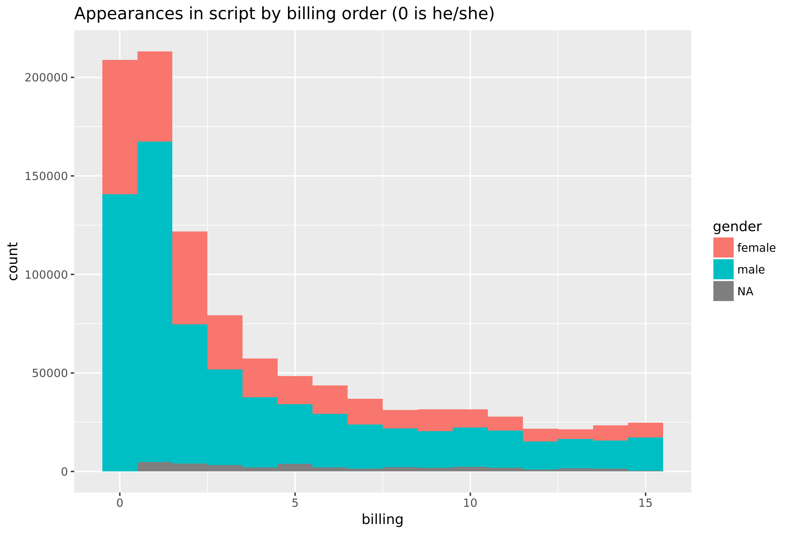
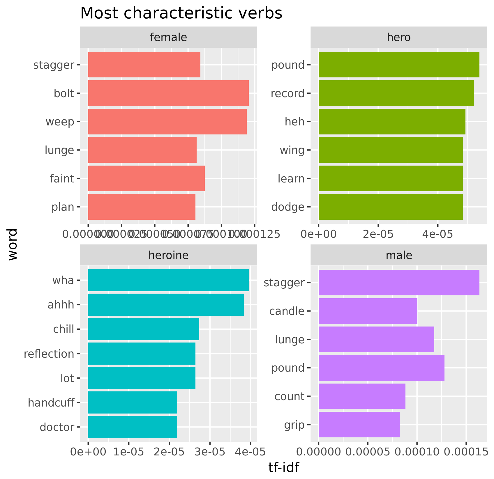
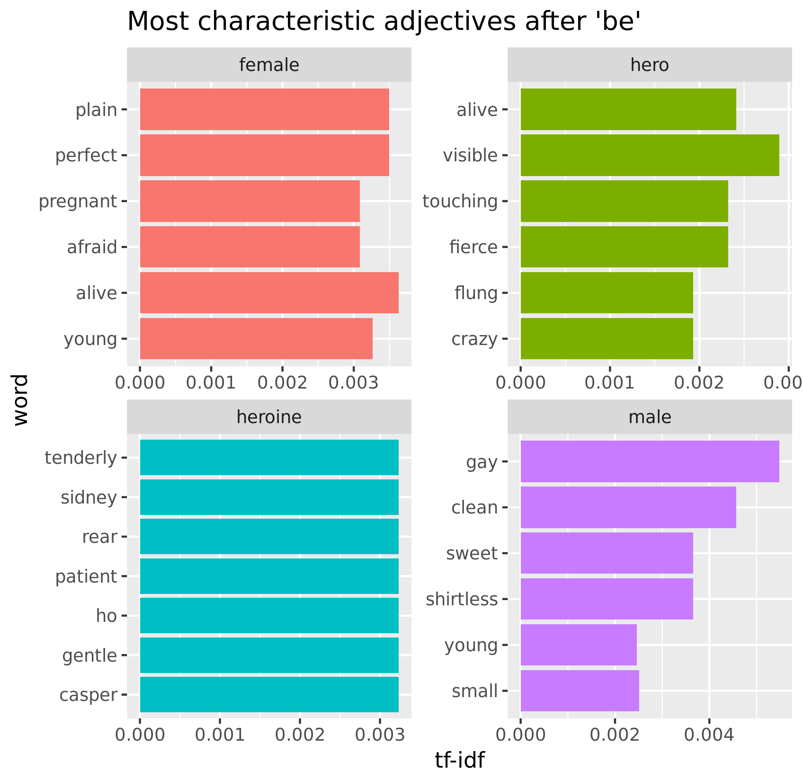

# Heroes and Heroines

I scraped over a 1000 movie scripts and looked at how male and female roles appear in them.-

Two projects based on movie screenplays have been published on pudding, based on [screen direction](https://pudding.cool/2017/08/screen-direction/) and [lines of dialogue](https://pudding.cool/2017/03/film-dialogue/). They use the same data but the [method](https://github.com/matthewfdaniels/scripts/) the first article provides for finding it is not very effective, so I had to make my own script database, with about half the number of scripts they had. 

## Who is a hero and what are they like?

As hard as finding out who a hero is, here I will use the easiest answer I could think of. That is, the heroes of a movie are the ones listed in the top 2 of the 'top billed cast' on imdb's page. Also, somewhat politically incorrectly, I will use hero and heroine phrases to separate these heroes into two genders, based on the names of the actors who portray them. 

What they say and do or what they are like is deduced from the script. Whatever appears in the second word of bigrams (basically two words after one another), where the first word corresponds to the character name of someone, that is what they do or say. Screen direction, narration and dialogue are equally present in the script and are not separated here. To make sure that this is appropriately restricted to actions or relevant words, all names related to other characters are discarded.

About two thirds of all characters are portrayed by male actors, but this isn't heavily correlated with billing order, as seen in this first histogram. However, one significant difference is that the male occurences are half as common in second billing status as first one, but in the female cases, a similar dropoff only occurs after the second billing, as the first two are about equal.

Also, the hero definition seems to make at least some sense as the higher billed members appear more often.

Looking at the number of positive words that follow our heroes and heroines in this second graph, here it is even more articulated, that there is much less difference between first and second billing in the case of women than men. Second billing women even get more positive words than first billing ones.

Using TFIDF, that shows which words appear more often in some categories relative to others, we see that not many essentially feminine or masculine words are present, maybe the fact that heroines are lonely or radiant.

For a little more accurate insight, I tried using [spacyr](https://github.com/quanteda/spacyr), the R wrapper for the python package spacy, that does part of speech recognition. It turned out to be quite slow, so I opted for the python version. This way I could find verbs that immediately follow the occurrance of a name and adjectives that appear right before, or in the structur 'character be ADJ', as spacy can also recognize different forms of the word be.

Here we have a number of more interesting characteristic words. Also note that all words are filtered so that they belong to at least 20 different characters.

So we see that regular females tend to weep and faint, but also plan! While heroes apperently like to wing it, while dodging, pounding and learning stuff, also they 'heh'. Heroines chill, handcuff and reflect, while 'ahh', as regular males count and grip, but also pound. Note that some weird things might appear as verbs not because spacy is poor, but as I hade to parse over 1000 scripts in limited time, so I only parsed trigrams with character names in them. It was a hard task for spacy and some errors are expected.

Still, it did quite well with the adjectives.

It turns out that the characteristic non-hero female is alive, young, plain and perfect but also pregnant and afraid. Similarly, non-hero males are also young but small as well, while many times shirtles, a number of them gay and a lot clean and sweet. While heroes are also alive, they're not young, but crazy and fierce. Visible might be something from screen directions, that also seems relevant for a star. Heroines are tenderly gentle and patient, while I can't really make sense of the other words found, but spacy still did well.

So, if you want to be a hero, and can't relly follow John Lennon anymore as he suggests, don't go shirtless, don't get pregnant, stop weeping and counting, and get a little older.

## Data

The data was collected from [imdb](www.imdb.com) and [imsdb](www.imsdb.com), as I matched all the available scripts to imdb searches during scraping and data cleaning. The cast, with billing order and ratings broken down into demographics were collected from imdb.

